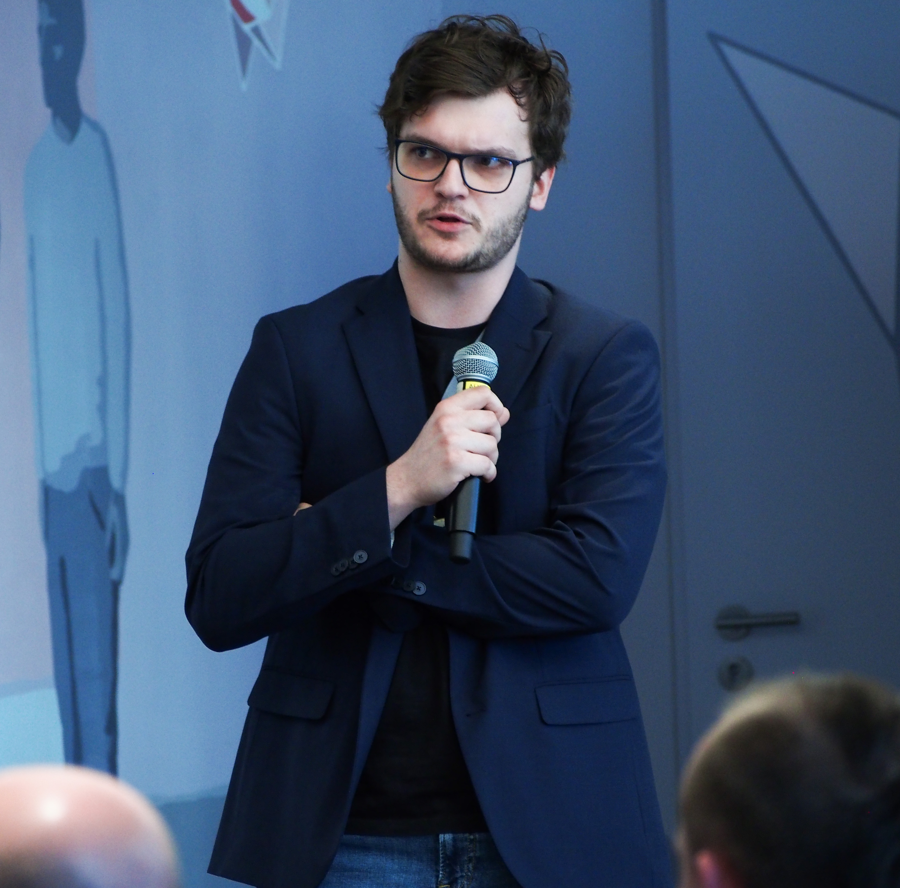
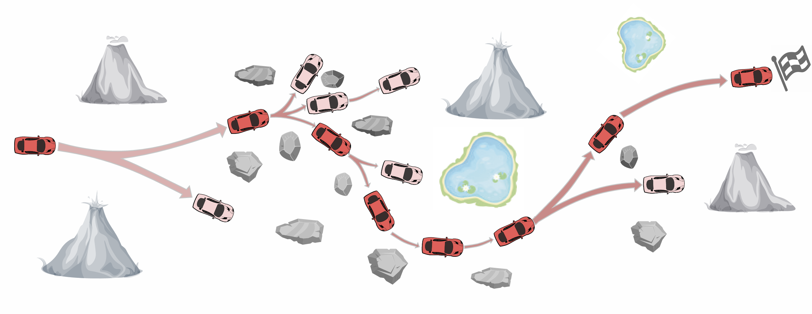

<!-- Custom Top Bar with Profile -->

  

    
  

  

    <h1 style="margin: 0; font-size: 1.7em;">Michał Tyrolski</h1>
    
Senior AI Consultant at Ernst & Young / Independent Researcher

    

      <a href="https://github.com/mtyrolski" style="margin-right: 10px;"><i class="fab fa-github"></i> GitHub</a>
      <a href="https://twitter.com/mtyrolski" style="margin-right: 10px;"><i class="fab fa-twitter"></i> Twitter</a>
      <a href="https://www.linkedin.com/in/michal-tyrolski/" style="margin-right: 10px;"><i class="fab fa-linkedin"></i> LinkedIn</a>
      <a href="../files/cv.pdf"><i class="fas fa-file-pdf"></i> CV</a>
    

  

I am **Michał Tyrolski**, a *Senior AI Consultant* at **Ernst & Young**. I hold an **M.Sc. in Machine Learning** (2023) and a **B.Sc. in Computer Science** (2021) from the **University of Warsaw**, where I was supervised by prof. Marek Cygan and prof. Piotr Miłoś.

My main research interests include **AI-based Planning**, **decision-making in complex environments**, **Meta-Reinforcement Learning**, and **Continual Learning**. Over the years, I’ve gained experience in both offline and online reinforcement learning, planning, efficient transformer architectures, and LLMs. I’ve also had the opportunity to be involved in AI projects at **Microsoft**, **Nvidia**, **Deepflare**, and **Samsung**.

I am an active member of the AI community, particularly with **ML in PL**, where I have been an organizer since 2020. In my free time, I enjoy mountain hiking and motorization.

You can view my [full CV here](../files/cv.pdf).

## Selected Publications


  

    

      <strong>{{ publication.title }}</strong> 
      <em>{{ publication.venue }}</em> 
      
        <a href="{{ publication.paperurl }}" class="paper-link">Paper</a>
      
      
        <a href="{{ publication.codeurl }}" class="paper-link">Code</a>
      
      
        <a href="{{ publication.websiteurl }}" class="paper-link">Website</a>
      
      
        
      
       {{ publication.excerpt }}
    

    

      
        
      
        Image Placeholder
      
    

  



## Other Papers


  

    

      <strong>{{ paper.title }}</strong> 
      <em>{{ paper.venue }}</em> 
      
        <a href="{{ paper.paperurl }}" class="paper-link">Paper</a>
      
       {{ paper.excerpt }}
    

    

      
        
      
        Image Placeholder
      
    

  



## Selected Projects

  

    <strong style="font-size: 1.2em; color: #1976d2;">CaRL Library: Combinatorial RL for planning</strong> 
    <em>Lead author & maintainer</em> 
    

      
    

    

      <b>CaRL</b> is an open-source library for scalable offline and online reinforcement/imitation learning in combinatorial planning problems. 
      <ul style="margin: 0.5em 0 0.5em 1.2em;">
        <li>Supports environments like <b>Sokoban</b>, <b>NPuzzle</b>, <b>Rubik</b>, and <b>INT</b>.</li>
        <li>Includes 35+ open-source models (Generator, Value, Policy, CLLP).</li>
        <li>Enables distributed experiments on SLURM clusters and local machines.</li>
        <li>Interactive Jupyter notebooks for research and reproducibility.</li>
        <li>Used in multiple peer-reviewed papers.</li>
      </ul>
      <b>Key features:</b> modular architecture, Hydra config extension, heterogeneous job support, remote deployment, and dataset demos.
    

    

      <a href="https://github.com/mtyrolski/carl" style="display: inline-block; background: #1976d2; color: #fff; padding: 0.4em 1.2em; border-radius: 5px; text-decoration: none; font-weight: 600; margin-right: 0.7em; transition: background 0.2s;">GitHub Repo</a>
      <a href="https://arxiv.org/abs/2406.03361" style="display: inline-block; background: #c62828; color: #fff; padding: 0.4em 1.2em; border-radius: 5px; text-decoration: none; font-weight: 600; transition: background 0.2s;">Latest Paper</a>
    

  

