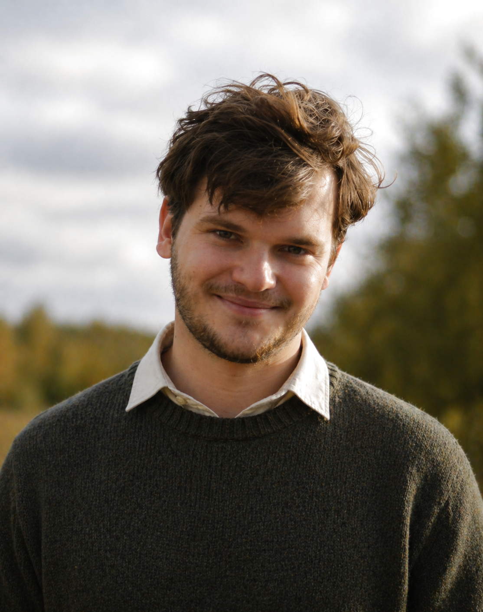
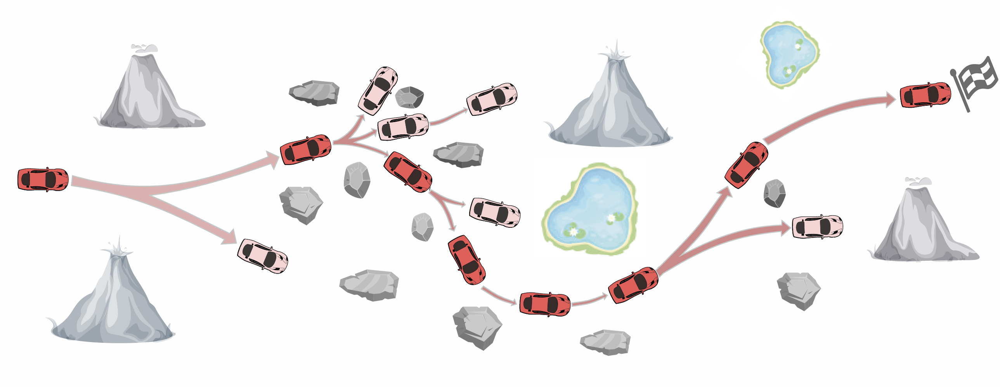
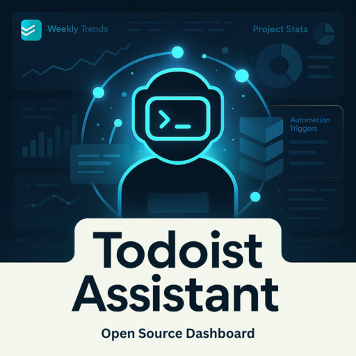

<!-- Custom Top Bar with Profile -->

  

    

    
    

    

      <h1>Michał Tyrolski</h1>
      
Senior AI Consultant at Ernst & Young / Independent Researcher

      

        <a href="https://github.com/mtyrolski"><i class="fab fa-github"></i> GitHub</a>
        <a href="https://twitter.com/mtyrolski"><i class="fab fa-twitter"></i> Twitter</a>
        <a href="https://www.linkedin.com/in/mtyrolski/"><i class="fab fa-linkedin"></i> LinkedIn</a>
        <a href="{{ site.author.googlescholar }}"><i class="ai ai-google-scholar"></i> Scholar</a>
      

    

  

  

    Profile My name is <strong>Michał Tyrolski</strong>. I’m a <em>Senior AI Consultant</em> at <strong>Ernst & Young</strong>, where I work on Agentic AI systems. I hold an <strong>M.Sc. in Machine Learning</strong> (2023), supervised by Prof. <a href="https://www.mimuw.edu.pl/~pmilos/">Piotr Miłoś</a> and Prof. <a href="https://scholar.google.com/citations?hl=en&user=df8TSy4AAAAJ">Marek Cygan</a>, and a <strong>B.Sc. in Computer Science</strong> (2021), supervised by Prof. <a href="https://www.mimuw.edu.pl/~henrykm/resume.html">Henryk Michalewski</a> and Prof. <a href="https://scholar.google.com/citations?user=JWmiQR0AAAAJ&hl=en">Łukasz Kaiser</a>. Both degrees are from the <a href="https://www.mimuw.edu.pl/en/"><strong>University of Warsaw, MIM Faculty</strong></a>.  
    Research Focus My research interests lie at the intersection of <strong>AI-based Planning</strong>, <strong>decision-making in complex environments</strong>, and <strong>Reinforcement Learning</strong>. I study how intelligent agents can select useful abstractions, adapt their planning horizon, and generalise under distribution shift across diverse problem settings.   

  

<!-- Generic Actual Info -->
  

My broader experience spans research and engineering across large-scale machine learning, distributed systems, scientific AI, and applied intelligent systems through work with NVIDIA, Microsoft, Samsung, DeepFlare, and Ernst & Young. I am an active member of the broader AI community, particularly through the <a href="https://mlinpl.org/"><strong>ML in PL Association</strong></a>, a non-profit supporting the machine learning community in Poland and across Central & Eastern Europe. Since 2020, I have contributed to scientific programme activities and conference organisation across multiple editions, including the upcoming <a href="https://conference.mlinpl.org/2026/">10th anniversary conference</a>.

You can view my [full CV here](../files/cv.pdf).

## Selected Publications



  

    

      <strong>{{ publication.title }}</strong> 
      <em>{{ publication.venue }}</em> 
      

        
          <a href="{{ publication.paperurl }}" class="paper-link">{{ publication.paperlabel | default: "Paper" }}</a>
        
        
          <a href="{{ publication.codeurl }}" class="paper-link">{{ publication.codelabel | default: "Code" }}</a>
        
        
          <a href="{{ publication.websiteurl }}" class="paper-link">{{ publication.websitelabel | default: "Website" }}</a>
        
        
          
        
        
          

            
Cite

            
{{ publication.citation }}

          

        
      

      
{{ publication.excerpt }}

    

  

      
        
      
        Image Placeholder
      
    

  



## Other Papers


  

    

      <strong>{{ paper.title }}</strong> 
      <em>{{ paper.venue }}</em> 
      

        
          <a href="{{ paper.paperurl }}" class="paper-link">Paper</a>
        
        
          

            
Cite

            
{{ paper.citation }}

          

        
      

      
{{ paper.excerpt }}

    

  

      
        
      
        Image Placeholder
      
    

  



## Selected Projects

  

    

      <strong class="project-title">CaRL Library: Combinatorial RL for Planning</strong> 
      

        <b>CaRL</b> is an open-source library for offline and online reinforcement/imitation learning in combinatorial planning.
      

      

        <a href="https://github.com/mtyrolski/carl">GitHub Repo</a>
        <a href="https://arxiv.org/abs/2406.03361" class="paper">Latest Paper</a>
      

    

    

      
    

  

  

    

      <strong class="project-title">Todoist Assistant</strong> 
      

        Local-first Todoist dashboard and automation toolkit with optional summaries and read-only chat over cached activity.
      

      

        <a href="https://github.com/mtyrolski/todoist-assistant">GitHub Repo</a>
      

    

    

      
    

  

